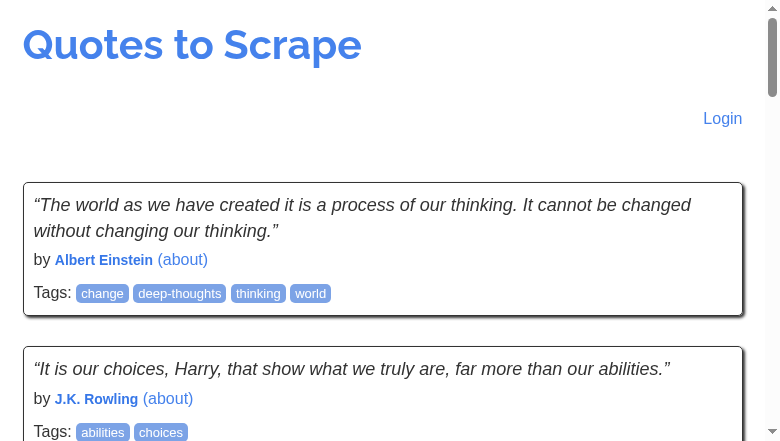

# Quotes Crawler

Projeto de raspagem automatizada do site [quotes.toscrape.com](http://quotes.toscrape.com), utilizando **Selenium** com saída estruturada em **CSV**, logs detalhados, screenshot da consulta, visualização com **Pandas**, agendamento com horário fixo e empacotamento com **Docker**.

---

## Funcionalidades:

- Extração dinâmica de citações, autores e tags
- Armazenamento estruturado em .csv
- Screenshot automático da página
- Visualização de resultados com Pandas
- Logs com Loguru
- Agendamento de execução diária
- Execução via Docker

---

## Estrutura do Projeto:

```

QUOTES-CRAWLER/
├── logs/
│   └── crawler.log
├── output/
│   ├── quotes.csv
│   └── screenshot.png
├── scraper/
│   ├── __init__.py
│   ├── parser.py
│   └── utils.py
├── .gitignore
├── crawler.py
├── Dockerfile
├── main.py
├── README.md
├── requirements.txt
├── scheduler.py

```

---

## Exemplos Visuais:

### Tela capturada da execução com Selenium:



### Terminal com logs e visualização dos dados:


---

## Como Executar Localmente:

### 1. Clonar o repositório

```bash
git clone https://github.com/jaquetrevizan/quotes-crawler.git
cd quotes-crawler
```

### 2. Criar ambiente virtual

```bash
python -m venv venv
source venv/bin/activate        # macOS/Linux
venv\Scripts\activate           # Windows
```

### 3. Instalar dependências

```bash
pip install -r requirements.txt
```

### 4. Executar o projeto

```bash
python main.py
```

---

## Como Executar com Docker:

### Build da imagem

```bash
docker build -t quotes-crawler .
```

### Executar o container

```bash
docker run --rm \
  -v ${PWD}/output:/app/output \
  -v ${PWD}/logs:/app/logs \
  quotes-crawler
```

> No Windows (PowerShell):
>
> ```powershell
> docker run --rm -v ${PWD}\output:/app/output -v ${PWD}\logs:/app/logs quotes-crawler
> ```

---

## Agendamento de Execução:

O script `scheduler.py` agenda a execução diária do crawler às 08:00 usando a biblioteca [`schedule`](https://pypi.org/project/schedule/):

```bash
python scheduler.py
```

---

## Amostra dos dados extraídos (`quotes.csv`):

```csv
"text","author","tags"
"The world as we have created it is a process of our thinking. It cannot be changed without changing our thinking.","Albert Einstein","['change', 'deep-thoughts', 'thinking', 'world']"
"It is our choices, Harry, that show what we truly are, far more than our abilities.","J.K. Rowling","['abilities', 'choices']"
...
```

---

## Próximas Etapas:

- Armazenar os dados extraídos em um banco de dados relacional ou não relacional (ainda a definir);
- Criar uma interface web com Django para exibição das citações e filtros por autor/tag;
- Adicionar visualizações de estatísticas (ex: número de citações por autor ou tag);
- Criar um `docker-compose.yml` para facilitar a orquestração dos serviços.

---

## Dúvidas:

Se você tiver alguma dúvida sobre este repositório, envie-a para trevizan.jaqueline@gmail.com.
